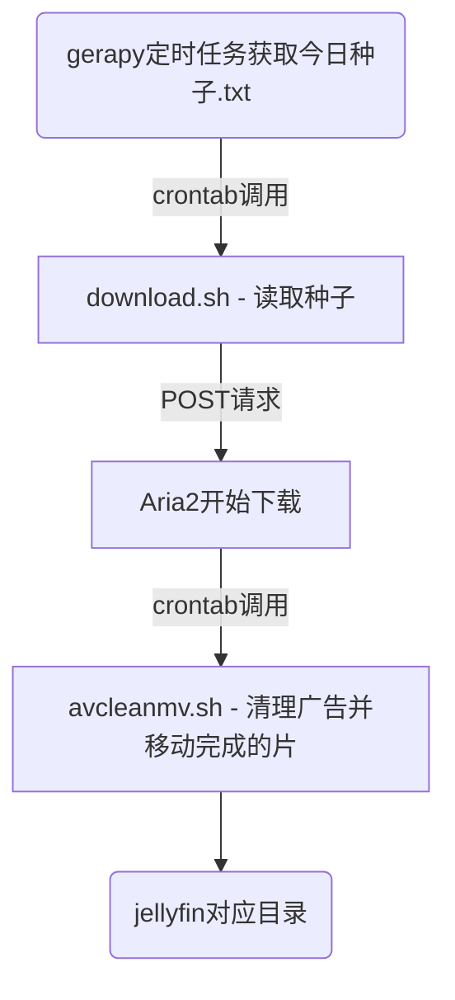

### 使用
javScrapy中的shell目录，包含了2个shell脚本，通过配合系统`crontab`实现

```mermaid
graph TB
    A(gerapy定时任务获取今日种子.txt) -- crontab调用 --> B[download.sh - 读取种子];
    B -- POST请求 --> C[Aria2开始下载];
    C -- crontab调用 --> D[avcleanmv.sh - 清理广告并移动完成的片];
    D --> F(jellyfin对应目录);
```
